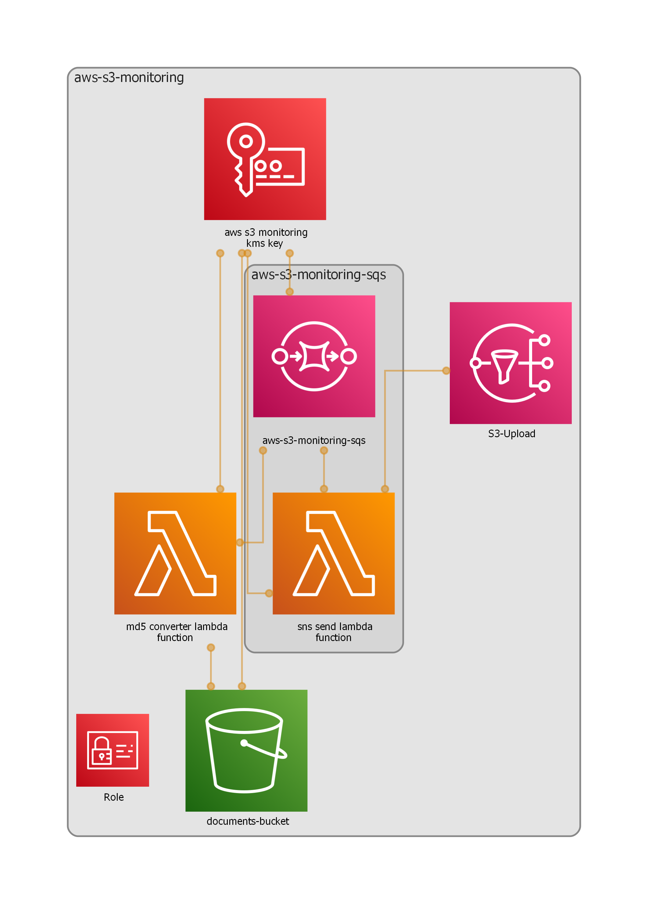

<div id="top"></div>


<!-- PROJECT LOGO -->
<br />
<div align="center">
  <a href="https://github.com/sz3jdii/aws-s3-monitoring">
    
  </a>

<h3 align="center">AWS S3 Monitoring</h3>

  <p align="center">
    Simple app for monitoring uploaded files to S3 bucket.
    <br />
  </p>
</div>


<!-- TABLE OF CONTENTS -->
<details>
  <summary>Table of Contents</summary>
  <ol>
    <li>
      <a href="#about-the-project">About The Project</a>
      <ul>
        <li><a href="#built-with">Built With</a></li>
      </ul>
    </li>
    <li>
      <a href="#getting-started">Getting Started</a>
      <ul>
        <li><a href="#prerequisites">Prerequisites</a></li>
        <li><a href="#installation">Installation</a></li>
      </ul>
    </li>
    <li><a href="#license">License</a></li>
    <li><a href="#contact">Contact</a></li>
  </ol>
</details>


<!-- ABOUT THE PROJECT -->
## About The Project
<div align="center">
    
</div>
This app was made during learning process of AWS CDK V2. It's purpose is to send notification every time file is uploaded to S3 bucket.

<p align="right">(<a href="#top">back to top</a>)</p>


### Built With

* [Projen](https://github.com/projen/projen)
* [AWS CDK V2](https://docs.aws.amazon.com/cdk/v2/guide/home.html)
* [nodeJS](https://nodejs.org/en/)
* [TypeScript](https://www.typescriptlang.org/)

<p align="right">(<a href="#top">back to top</a>)</p>


<!-- GETTING STARTED -->
## Getting Started

To get a local copy up and running follow these simple example steps.

### Prerequisites

This is an example of how to list things you need to use the software and how to install them.
* npm
  ```sh
  npm install npm@latest -g
  ```

### Installation

1. Clone the repo
   ```sh
   git clone https://github.com/sz3jdii/aws-s3-monitoring.git
   ```
2. Install NPM packages
   ```sh
   npm install
   ```
3. Use projen or cdk
   ```sh
   projen diff
   cdk diff
   projen deploy
   cdk deploy
   ```
<p align="right">(<a href="#top">back to top</a>)</p>

<!-- LICENSE -->
## License

Distributed under the MIT License. See `LICENSE` for more information.

<p align="right">(<a href="#top">back to top</a>)</p>


<!-- CONTACT -->
## Contact

Adam Świątkowski - [@szeejdi](https://twitter.com/szeejdi) - adam@sz3jdii.com

Project Link: [https://github.com/sz3jdii/aws-s3-monitoring](https://github.com/sz3jdii/aws-s3-monitoring)

<p align="right">(<a href="#top">back to top</a>)</p>